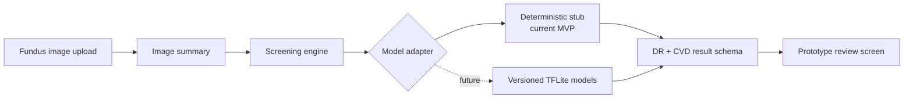

# TEHI — The Eyes Have It

[](https://github.com/BStofftTX/TEHI-AI-DR-project/actions/workflows/ci.yml)
[](https://nodejs.org/)
[](#project-status)

**TEHI (The Eyes Have It)** is a medical-imaging AI research and product-development project exploring retinal fundus photography as a screening input for diabetic retinopathy and cardiovascular risk.

The project was conceived and is led by **W. Bruce Stofft** through **MacroStofft LLC**, building on his graduate research in artificial intelligence at the University of South Dakota.

> [!IMPORTANT]
> TEHI is a research MVP—not a medical device or diagnostic system. The current public prototype uses deterministic stub inference and must not be used for clinical decisions.

## Project status

The repository currently demonstrates the end-to-end product workflow around an intentionally replaceable inference layer. It does **not** contain validated production models, clinical performance claims, or deployable medical-device software.

| Capability | Current state |
| --- | --- |
| Smartphone-first fundus-image upload flow | Implemented |
| Five-class diabetic retinopathy result schema | Implemented with stub inference |
| Binary cardiovascular-risk result schema | Implemented with stub inference |
| Replaceable model-adapter architecture | Implemented |
| Automated application and route tests | Implemented |
| Validated model weights and preprocessing | Planned |
| Clinical validation and regulatory readiness | Future work |

## Why this project matters

Retinal images may contain clinically useful signals beyond eye disease. TEHI investigates how a carefully validated screening workflow could help clinicians identify patients who may need additional review while keeping human oversight, model traceability, privacy, and safety central to the system design.

The repository preserves original 2022 training notebooks and selected experimental results, but does not contain production-ready model weights or a clinically validated inference pipeline. The 2026 MVP therefore uses deterministic stub inference while retaining a clean path for future validated model integration.

## Architecture



The adapter boundary lets the interface, routing, result schema, and safety messaging be tested without presenting placeholder output as medical inference. See [ARCHITECTURE.md](ARCHITECTURE.md) for the component-level design.

## Technical highlights

- Dependency-light Node.js HTTP application
- Mobile-first image capture and upload experience
- Separate presentation, application, and inference layers
- Pluggable adapters for stub and future TensorFlow Lite inference
- Deterministic outputs for repeatable prototype testing
- Native Node.js test suite covering routes and screening schema
- Explicit safety language throughout the user flow

## Run locally

### Requirements

- Node.js 20 or newer

### Start the application

```bash
npm run dev
```

Then open [http://localhost:3000](http://localhost:3000).

### Run the tests

```bash
npm test
```

No model files or third-party runtime dependencies are required for the current stub-based MVP.

## Repository structure

```text
src/
  server.js                # HTTP server
  routes.js                # request routing
  inference/
    screeningEngine.js     # output orchestration
    stubModel.js           # deterministic placeholder inference
    modelRegistry.js       # planned model artifacts
    adapters/
      stubAdapter.js       # active MVP adapter
      tfliteAdapter.js     # future production adapter seam
  utils/
    imageSummary.js        # uploaded-image metadata summary
  views/                   # landing, result, and integration UI
test/                      # route and screening-engine tests
research/2022-dr/          # original notebooks, results, and context
```

## Development roadmap

The next engineering phase focuses on:

1. Establishing licensed, well-documented fundus-image datasets
2. Creating reproducible preprocessing and data-partition pipelines
3. Training and independently evaluating DR and CVD models
4. Adding calibration, subgroup analysis, and external validation
5. Versioning models, labels, and preprocessing metadata together
6. Adding clinician review, audit logging, privacy, and security controls
7. Defining regulatory and deployment requirements before field use

See [ROADMAP.md](ROADMAP.md) for milestones and evidence gates.

## Original 2022 AI research

TEHI grew from graduate computer-vision research using retinal fundus imagery for five-class diabetic retinopathy classification.

Preserved research artifacts include:

- ImageNet-pretrained **Inception v3** and **VGG19** transfer-learning experiments
- TensorFlow/Keras and Jupyter notebooks
- 224×224 fundus-image preprocessing and data augmentation
- Five-class DR classification from No DR through Proliferative DR
- Confusion-matrix evaluation and saved TensorFlow/Keras models
- Historical validation accuracy of **74.38%** for the recovered Inception v3 run and **76.88%** for the recovered VGG19 run

The notebooks, selected results, methodology, limitations, and historical context are documented under [`research/2022-dr/`](research/2022-dr/).

These historical experimental results are research artifacts and **not clinically validated diagnostic performance**.

## Research provenance

The MVP follows the direction established in the project’s original concept and research materials:

- `Vision final project idea.docx`
- `Stofft DR paper.docx`
- `Stofft-CVD Paper.docx`

Project stewardship and prior contributions are documented in [CONTRIBUTORS.md](CONTRIBUTORS.md).

## Contributing and security

- Read [CONTRIBUTING.md](CONTRIBUTING.md) before proposing changes.
- Report security concerns using the process in [SECURITY.md](SECURITY.md).
- Do not submit protected health information, private medical data, or unlicensed datasets.

## Medical disclaimer

This repository is for research and software-prototyping purposes only. It has not been clinically validated, cleared, or approved for diagnosis, treatment, triage, or patient management. Any future clinical use would require appropriate data governance, independent validation, clinician oversight, security controls, and regulatory review.
